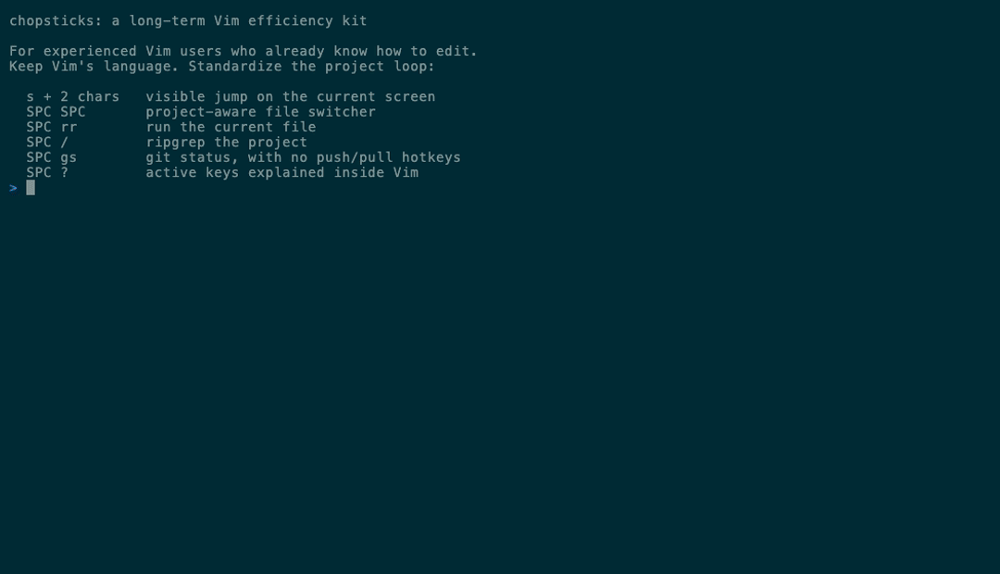

<p align="center">
  
</p>

<h1 align="center">chopsticks</h1>

<p align="center">
  <strong>Vim for engineers. ~25 plugins, works over SSH.</strong>
</p>

<p align="center">
  <a href="LICENSE"></a>
  <a href="https://www.vim.org/"></a>
  <a href="#install"></a>
  <a href="https://github.com/m1ngsama/chopsticks/actions"></a>
  <a href="https://github.com/m1ngsama/chopsticks/releases"></a>
</p>

---

```bash
curl -fsSL https://raw.githubusercontent.com/m1ngsama/chopsticks/main/get.sh | bash
```

---

## Why

You SSH into a server. You need to edit code. You want LSP, fuzzy find, git integration, format-on-save — not a 20-minute setup.

chopsticks gives you a production-ready Vim config in one command. Pure VimScript — no Node.js for the core. Degrades gracefully on TTY. Works the same on your MacBook and your headless Arch box.

**24–25 plugins** (tmux-navigator loads only inside tmux), LSP, linting, and a hand-built statusline. No bloat, no decorations, just tools.

## What's in the box

| Feature           | Description                                                                                                                                                    |
| ----------------- | -------------------------------------------------------------------------------------------------------------------------------------------------------------- |
| **LSP**           | completion, go-to-def, hover, rename, code actions — pure VimScript ([vim-lsp](https://github.com/prabirshrestha/vim-lsp))                                     |
| **Lint + format** | [ALE](https://github.com/dense-analysis/ale) runs black, prettier, goimports, rustfmt on save                                                                  |
| **Fuzzy find**    | files, buffers, grep, tags, marks, commands — [FZF](https://github.com/junegunn/fzf.vim)                                                                       |
| **Git**           | status, diff, blame, push, pull, conflict markers — [fugitive](https://github.com/tpope/vim-fugitive) + [gitgutter](https://github.com/airblade/vim-gitgutter) |
| **Run file**      | `,cr` — auto-detects Python, Go, Rust, JS, C, Shell, and more                                                                                                  |
| **Markdown**      | quiet writing defaults, browser preview (`,mp`), table of contents (`,mt`)                                                                                     |
| **Diagnostics**   | `:ChopsticksStatus` — see what's installed, what's missing, how to fix it                                                                                      |
| **TTY-aware**     | degrades gracefully on SSH, console, slow links — never breaks                                                                                                 |

## Install

```bash
curl -fsSL https://raw.githubusercontent.com/m1ngsama/chopsticks/main/get.sh | bash
curl -fsSL https://raw.githubusercontent.com/m1ngsama/chopsticks/main/get.sh | bash -s -- --profile=minimal
curl -fsSL https://raw.githubusercontent.com/m1ngsama/chopsticks/main/get.sh | bash -s -- --dry-run --profile=full
```

Or manually:

```bash
git clone https://github.com/m1ngsama/chopsticks.git ~/.vim
cd ~/.vim && ./install.sh --profile=engineer
```

Supports macOS (brew), Debian/Ubuntu (apt), Arch (pacman), Fedora (dnf).
Set `CHOPSTICKS_DEST=/absolute/path` before running `get.sh` to install
somewhere other than `~/.vim`.

First launch installs plugins automatically (30-60s). Restart vim when done.
Use `./install.sh --dry-run --profile=full` to inspect the resolved profile and
config path without changing files. Use `./install.sh --configure-only
--profile=minimal` to switch profiles without reinstalling plugins or tools.

## Profiles

Default profile: `engineer`. Interactive installs ask for this profile before
plugins are installed; `--profile=minimal`, `--profile=engineer`, or
`--profile=full` selects it without prompting. `--yes` keeps the existing local
profile or uses `engineer`.

```vim
" Put this in ${XDG_CONFIG_HOME:-~/.config}/chopsticks.vim.
let g:chopsticks_profile = 'minimal'   " core navigation/editing/git/markdown
let g:chopsticks_profile = 'engineer'  " default: LSP, ALE, syntax extras
let g:chopsticks_profile = 'full'      " engineer + heavier Markdown feedback
```

`minimal` avoids LSP, ALE, completion plugins, extra language syntax plugins,
Startify, UndoTree, and browser Markdown preview. `full` keeps those and opts
into Markdown lint, format, spell, conceal, Marksman, and LSP virtual text.

Project updates leave `~/.config/chopsticks.vim` alone, so put local choices
there instead of editing the managed `.vimrc`. The `,?` cheat sheet follows the
active profile and only shows keys for enabled features.

## Keys

Leader: `,`

```
Ctrl+p    fuzzy find file          ,dd   go to definition
,rg       ripgrep project          ,dk   hover docs
,e        toggle file sidebar      ,cr   run current file
,gs       git status               ,f    format
,w        save                     ,q    quit
jk        exit insert mode         ,?    cheat sheet
```

<details>
<summary><strong>All keybindings</strong></summary>

### Files

`Ctrl+p` find | `,b` buffers | `,rg` grep | `,rG` grep word | `,fh` recent | `,fl` lines | `,e` browser | `,E` browser (file dir) | `,,` last file

### Code

`,dd` def | `,dt` type | `,di` impl | `,dr` refs | `,dk` docs | `,dp` `,dn` diagnostics | `[e` `]e` ALE errors | `,rn` rename | `,ca` action | `,o` outline | `,cr` run

### Edit

`,S`+2ch jump | `gc` comment | `cs"'` surround | `Alt+j/k` move line | `,u` undo tree | `,y` clipboard | `,*` replace word | `,F` re-indent | `,W` strip whitespace | `[<Space>` `]<Space>` blank lines

### Git

`,gs` status | `,gd` diff | `,gb` blame | `,gc` commit | `,gp` push | `,gl` pull | `,gL` log graph | `,gC` FZF commits | `,gB` buffer commits | `]x` `[x` conflict

### Windows

`Ctrl+hjkl` navigate (+ tmux) | `,z` maximize | `,h` `,l` buffers | `,bd` close buffer | `,=` `,−` resize | `,tv` `,th` terminal | `Esc Esc` exit terminal

### Markdown

`,mp` preview in browser | `,mt` table of contents

### Toggle

`F2` paste | `F3` line numbers | `F4` relative numbers | `F6` invisible chars | `,ss` spell check | `,af` format on save

### Utilities

`,cp` copy full path | `,cf` copy filename | `,ev` edit vimrc | `,sv` reload vimrc | `,wa` save all | `:ChopsticksStatus` diagnostics

</details>

## LSP

```vim
:LspInstallServer    " auto-detects filetype
:LspStatus           " check what's running
:ChopsticksStatus    " see all tools + LSP + linters at a glance
```

pylsp, gopls, rust-analyzer, clangd, sqls — no Node.js. JS/TS servers need Node.
Markdown LSP (`marksman`) is opt-in so prose buffers stay quiet by default.

ALE and vim-lsp coexist cleanly (`ale_disable_lsp=1`). ALE handles linting + formatting. vim-lsp handles everything else.

## Markdown

Markdown opens in writing mode: wrapped text, no spell noise, no concealed
syntax, no sign column, no real-time markdownlint, and no Marksman diagnostics.
The explicit commands still work:

```vim
,mp    " preview in browser
,mt    " table of contents
```

Opt into heavier Markdown tooling from your own vimrc before loading
chopsticks:

```vim
let g:chopsticks_markdown_lint = 1
let g:chopsticks_markdown_format_on_save = 1
let g:chopsticks_markdown_lsp = 1
let g:chopsticks_markdown_spell = 1
let g:chopsticks_markdown_conceal = 1
let g:previm_enable_realtime = 1
```

For Markdown LSP, install or select `marksman` first.

## Architecture

```
~/.vim/
├── .vimrc              thin loader
├── modules/
│   ├── env.vim         TTY detection, truecolor, skip built-in plugins
│   ├── plugins.vim     vim-plug + 24–25 plugins
│   ├── core.vim        settings, keymaps, performance
│   ├── ui.vim          solarized, statusline, startify
│   ├── editing.vim     easymotion, yank highlight, blank lines
│   ├── navigation.vim  fzf, netrw sidebar, windows, terminal
│   ├── lsp.vim         vim-lsp, asyncomplete
│   ├── lint.vim        ale, format-on-save
│   ├── git.vim         fugitive, gitgutter, conflict nav
│   ├── languages.vim   vim-go, markdown, filetype settings
│   └── tools.vim       run file, quickfix, cheat sheet, diagnostics
```

Each module is self-contained. Comment out one line in `.vimrc` to disable it. Add your own with `call s:load('mine')`.

## Performance

| Metric                   | Value                                       |
| ------------------------ | ------------------------------------------- |
| Lazy-loaded              | 7 plugins (on command or filetype)          |
| Built-in plugins skipped | 12 (gzip, tar, zip, vimball, logiPat, etc.) |
| Large file threshold     | 10MB (auto-disables syntax + undo)          |
| TTY large file           | 500KB (syntax disabled)                     |

## Troubleshooting

| Problem             | Fix                                           |
| ------------------- | --------------------------------------------- |
| Plugins not loading | `:PlugInstall` then `:PlugUpdate`             |
| LSP not starting    | `:LspInstallServer` for current filetype      |
| Colors wrong        | `export COLORTERM=truecolor` in shell rc      |
| `Ctrl+s` freezes    | `stty -ixon` in shell rc                      |
| Everything slow     | Large file? Auto-disabled >10MB               |
| What's installed?   | `:ChopsticksStatus` shows tools, LSP, linters |

More in the [wiki](https://github.com/m1ngsama/chopsticks/wiki).

## Contributing

See [CONTRIBUTING.md](CONTRIBUTING.md). The two rules that matter: no Node.js dependencies, and don't regress startup time.

## License

[MIT](LICENSE)
